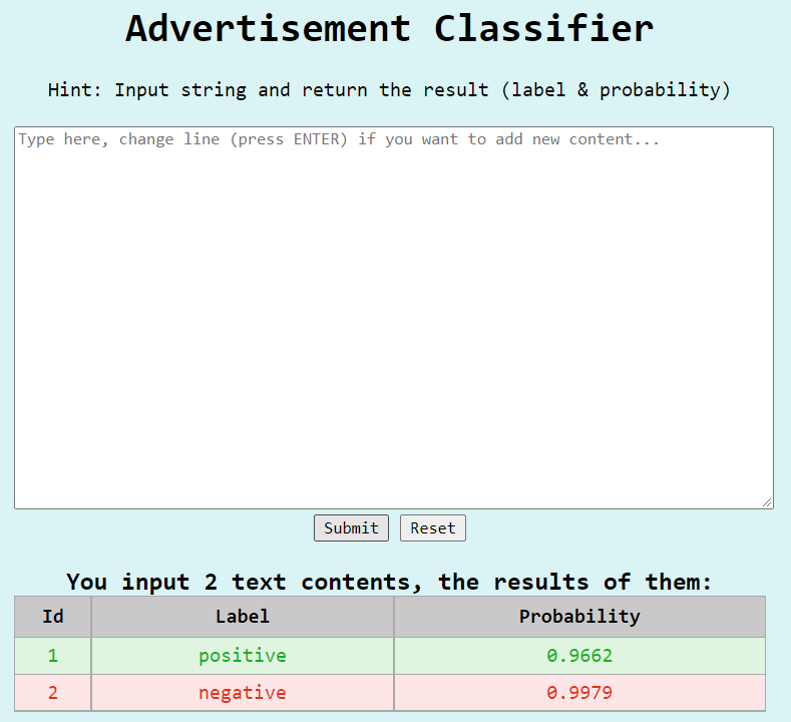

<!--
*** Thanks for checking out the Best-README-Template. If you have a suggestion
*** that would make this better, please fork the repo and create a pull request
*** or simply open an issue with the tag "enhancement".
*** Thanks again! Now go create something AMAZING! :D

***
***
***
*** To avoid retyping too much info. Do a search and replace for the following:
*** github_username, repo_name, twitter_handle, email, project_title, project_description
-->


<!-- PROJECT SHIELDS -->
<!--
*** I'm using markdown "reference style" links for readability.
*** Reference links are enclosed in brackets [ ] instead of parentheses ( ).
*** See the bottom of this document for the declaration of the reference variables
*** for contributors-url, forks-url, etc. This is an optional, concise syntax you may use.
*** https://www.markdownguide.org/basic-syntax/#reference-style-links
-->
[![Contributors][contributors-shield]][contributors-url]
[![Forks][forks-shield]][forks-url]
[![Stargazers][stars-shield]][stars-url]
[![Issues][issues-shield]][issues-url]
[![MIT License][license-shield]][license-url]
[![LinkedIn][linkedin-shield]][linkedin-url]


<!-- PROJECT LOGO -->
<br />

<p align="center">
  <a href="https://github.com/github_username/repo_name">
    
  </a>
  <h3 align="center">Advertisement Content Classifier</h3>
<p style="text-align: center">
    The main contribution of this project is to build a Command-Line Interface and Web applications that can classify the advertisement content.</p>
<p style="text-align: center">
    <br />
    <a href="https://github.com/ychuang789/AD_classifier/tree/master"><strong>Explore the docs »</strong></a>
    <br />
    <br />
    <a href="https://github.com/ychuang789/AD_classifier/blob/master/AD_classifier.pptx">View Slides</a>


<!-- TABLE OF CONTENTS -->

<details open="open">
  <summary><h2 style="display: inline-block">Table of Contents</h2></summary>
  <ol>
    <li>
      <a href="#about-the-project">About The Project</a>
      <ul>
        <li><a href="#what is advertisement content?">What is advertisement content?</a></li>
        <li><a href="#project-work-flow">Project work flow</a>
        <li><a href="#built-with">Built With</a></li>
      </ul>
    </li>
    <li>
      <a href="#getting-started">Getting Started</a>
      <ul>
        <li><a href="#prerequisites">Prerequisites</a></li>
        <li><a href="#installation">Installation</a></li>
      </ul>
    </li>
    <li><a href="#usage">Usage</a>
     <ul>
        <li><a href="#classifier-training">Classifier training</a></li>
        <li><a href="#CLI-application">CLI application</a></li>
        <li><a href="#WEB-application">WEB application</a></li>
      </ul> 
     </li>
    <li><a href="#roadmap">Roadmap</a></li>
    <li><a href="#contributing">Contributing</a></li>
    <li><a href="#license">License</a></li>
    <li><a href="#contact">Contact</a></li>
    <li><a href="#acknowledgements">Acknowledgements</a></li>
  </ol>
</details>


<!-- ABOUT THE PROJECT -->
## About The Project




### What is an advertisement content?

> An copywriting which is developed from the advertisement industry is the manuscript used in newspapers, magazines, posters and other print media or electronic media, TV commercials, web banners, etc., to promote products, companies, or ideas, or people who do this. 
>
> ​                                                                                                                                                        *from wikipedia*

Others important content of advertisement copywriting also include,

+ Purposeful and strategic text. 
+ The motivation of product sales. 
+ Commercial writing, it is mainly to solve customers' problems. 
+ A text that appears in any form to convey information to the target audience, urge them to act or change their beliefs.


### Project work flow

The project contains <u>three</u> parts of efforts, that is classifier training, **Command line interface (CLI)** application and **WEB** application building. 

+ In first step, we introduce the pre-trained language model, **albert**, from [huggingface transformers](https://huggingface.co/transformers/) and created a simple classifier with [pytorch](https://pytorch.org/). 
+ Secondly, we apply the best model to create application which allow users to classify the advertisement content through CLI, through typing the content or input a text file. It will return the message of label indicate which content is or isn't an advertisement and also return the output probability.
+ Last, we created the WEB version of application which assist user to classify multiple content through directly tying in the text area. The output will return the number of contents that users want to classify, the id of those content, the label (noted that they are in binary string format positive and negative).

For more information of the project please refer to the 

### Built with

This section list all major frameworks that building the project using. 

* [Click](https://click.palletsprojects.com/en/8.0.x/)

* [FastAPI](https://fastapi.tiangolo.com/)

* [Huggingface transformers](https://huggingface.co/transformers/)

* [Jinja2](https://jinja.palletsprojects.com/en/3.0.x/)

* [Pytorch](https://pytorch.org/)

  

<!-- GETTING STARTED -->
## Getting Started

To get a local copy up and running follow these simple steps.

### Prerequisites

This project is built in the python 3.8 environment. Make sure to install the corresponding version. 

+ [Python 3.8](https://www.python.org/downloads/release/python-380/)

###### Windows

* Create a virtual environment to re-construct the environment
  
  ```sh
  $ pip install virtualenv
  $ virtualenv venv
  $ venv\Scripts\activate.bat
  ```

### Installation

1. Clone the repo to the environment
   ```sh
   $ git clone https://github.com/ychuang789/AD_classifier.git
   ```
2. Install requirements packages 
   ```sh
   $ pip install -r requirements.txt
   ```


<!-- USAGE EXAMPLES -->
## Usage

### Classifier training

The default model arguments are:

| parameter        | default               | Note                                                         |
| ---------------- | --------------------- | ------------------------------------------------------------ |
| run_number       |                       | run number, change it if you run a new experiment            |
| data             | data.pkl              | support *pickle data* format with column `text` and `label`, replace it by your own dataset or use the default dataset. |
| device           | cpu                   | replace with `cuda:[number]`if  gpu is available             |
| n_classes        | 2                     | number of class, you **don't** have to modify this setting in this project |
| max_len          | 300                   |                                                              |
| batch_size       | 16                    |                                                              |
| epochs           | 10                    |                                                              |
| learning_rate    | 2e-5                  |                                                              |
| num_warmup_steps | 0                     |                                                              |
| loss_func        | nn.CrossEntropyLoss() | loss function                                                |

run the command to train the classifier:

```sh
$ python run.py 1 --data data.pkl --device cpu\
	--batch_size 16 --epochs 10 --learning_rate 1e-5
```

Track training and validation information at  `/model/run.log` ; check the output classification report at `/model/evaluate/` 

You can find out the best model for each run in the `/model/run/`

### CLI application

run the command

+ with `single` you are expected to input a single text content in the command line interface
+ with `file` you are expected to input a text file location (each line represent the different content) and it will ask you to name a new csv output file which includes texts with labels and probabilities. The output file will be saved in `/model/cli_output/`:

```sh
$ python click_classifier.py single
```

```sh
$ python click_classifier.py file
```

example:


| content                                                      | label    | probability |
| ------------------------------------------------------------ | -------- | ----------- |
| 台中市玩具圖書館就在台中市三十張犁婦女福利服務中心的二樓，這裡也是台中市新移民家庭服務中心。來這裡玩的小朋友限6歲以下，目前只有開放週五跟週六兩天，跟其它的玩具圖書館規則差不多，玩具只能在館內使用，每次可以借3種玩具，玩完一個才能借下一個，這裡的玩具有區分為益智類、語言類、社會生活類、操作類、嬰幼兒類五種。因為空間有限，所以每次最多只能有15位大人加小孩進場，若家裡有多的不用玩具，也歡迎分享出來給玩具圖書館哦。 | positive | 0.9570      |
| 我以為我高中不會有這種問題結果竟然在2017的最後一天發生事情是這樣的我們一群人一起去跨年晚會之後越來越晚有些人因為家住比較遠的關係就先回家了 最後就剩我和另外兩位很好的朋友我本來以為會剛剛的氛圍一樣大家開開心心的聊著結果 哈哈哈哈我錯了我被丟在後面因為人很多啊 我又很矮想說放慢速度他們會不會發現我沒跟上結果 也沒有哈哈哈哈哈後來是其中最常跟我膩在一起的朋友把我拉進去結果 他被另一個拉走 ...然後他們就自己講自己的自己笑自己的 啊我也不知道要怎樣就邊走邊滑手機 假裝很忙哈哈哈哈最後 那個跟我膩在一起的朋友也要回家了我跟他來個大擁抱 然後說個再見我就直接自己去搭公車回家了我就沒理另一個朋友其實這也不是第一次發生只是這次真的很尷尬 有一次是在學校我們三個聚在一起我突然想到我有事情還沒做完 我就先回去我的座位結果那個同學就說哦太好了 ***（我的名字）走了 我可以跟你講事情了他要講就講 沒事講這句幹嘛好啦 我只是想抱怨可能我太玻璃心 | negative | 0.9903      |

### WEB application

This WEB application support multiple content classification 

run the command

```sh
$ python web_api.py
```

and open the browser with http://127.0.0.1:8000 to open the WEB application

Type the content which you want to classify and press `ENTER` if you want to add new content. The result will be showed at the bottom of the text area with **id** represent each content, **label** and **probability**. 


<!-- ROADMAP -->
## Roadmap


<!-- CONTRIBUTING -->

## Contributing

 Any contributions you make are **greatly appreciated**.

1. Fork the Project
2. Create your Feature Branch (`git checkout -b feature/AmazingFeature`)
3. Commit your Changes (`git commit -m 'Add some AmazingFeature'`)
4. Push to the Branch (`git push origin feature/AmazingFeature`)
5. Open a Pull Request


<!-- LICENSE -->
## License

<!-- CONTACT -->
## Contact

Weber Yen-Chun Huang - ychuang@eland.com.tw

Project Link: [AD_classifier](https://github.com/ychuang789/AD_classifier)

<!-- ACKNOWLEDGEMENTS -->
## Acknowledgements

<!-- MARKDOWN LINKS & IMAGES -->
<!-- https://www.markdownguide.org/basic-syntax/#reference-style-links -->
